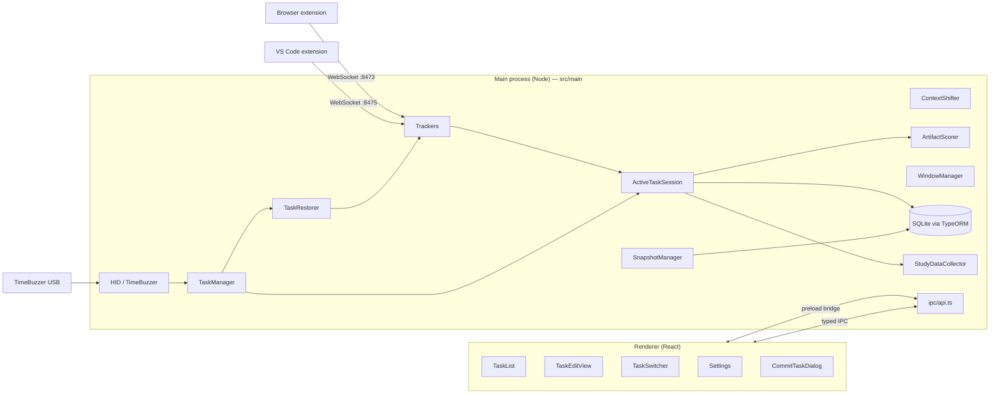

# ContextShifter — Architecture Overview

ContextShifter is an Electron desktop app (TypeScript + React) that helps developers and data scientists **switch and resume tasks**. Unlike its predecessor TaskSnap (which captured a context only when you pressed a button), ContextShifter keeps **one task active at a time** and **continuously tracks** the artefacts you use while it is active — applications, browser tabs, IDE files, and the project folder. When you stop or switch tasks it scores those artefacts by relevance, lets you confirm which to keep, and on the next switch **reopens the task's artefacts and closes the rest**.

A physical USB dial — the **TimeBuzzer** — drives the task switcher and lights up while a task is active.

This document is for newcomers: it lists the pieces, what each is responsible for, and how they connect.

> ContextShifter is a fork of [TaskSnap](https://github.com/HASEL-UZH) (Remy Egloff, HASEL Lab, UZH). Some snapshot-era components are kept but no longer drive the main flow — they are flagged **(legacy)** below.

---

## High-level layout

```
ContextShifter/
├── src/
│   ├── main/        Electron main process (Node side) — all "business logic" lives here.
│   ├── renderer/    React UI rendered inside Electron windows.
│   └── types/       Cross-process TypeScript types shared by main + renderer.
├── release/app/PA.WindowsActivityTracker/   Native window-tracking helper (vendored).
└── assets/          Tray icons, app icon, entitlements.
```

Two sibling repositories cooperate with the app over local WebSockets:

- **ContextShifter-browser-extension** — Chromium/Firefox extension that streams open tabs + window state to the main process (`ws://localhost:8473`) and accepts open/close-tab commands. Manifest V3, with a service-worker keep-alive so the connection survives the browser losing focus.
- **ContextShifter-vscode-extension** — VS Code extension that streams the active editor / open files / workspace folder (`ws://localhost:8475`) and accepts open-files, close-files, and **close-window** commands.

The TimeBuzzer dial driver is vendored in-app at `src/main/HID/time-buzzer.js`.

---

## Core idea: the active task

The central concept is the **active task session**:

1. You **start** (or resume) a task. From that moment ContextShifter tracks which artefacts you focus and for how long.
2. While active, [`ActiveTaskSession`](src/main/ActiveTaskSession.ts) accumulates per-artefact usage stats (foreground duration, access count, interactions, last access).
3. When you **stop** or **switch**, those stats are scored ([`ArtifactScorer`](src/main/ArtifactScorer.ts)), the highest-scoring artefacts are pre-selected, and you confirm the set in a picker.
4. Switching to another task then **restores** it ([`TaskRestorer`](src/main/TaskRestorer.ts)): it opens that task's saved artefacts and closes everything else (except "never close" items).

Stats are persisted ([`ArtifactUsage`](src/main/entity/ArtifactUsage.ts)) and reloaded when a task is reactivated, so a task's scoring **accumulates across multiple sessions** — and only the currently active task's stats are ever mutated.

---

## Process model



- **Main process** owns all state: database, trackers, hardware, scoring, window lifecycle.
- **Renderer** is presentational. It calls main via the typed IPC bridge in `preload.ts`.
- Cross-process types live in [src/types](src/types) so both sides stay in sync at compile time.

---

## Main-process components

### Orchestrators

| File | Role |
| --- | --- |
| [main.ts](src/main/main.ts) | Electron entry point. Initializes the DB, starts `ContextShifter`, opens the main window, registers global shortcuts, kicks off `StudyManager`/`Exporter` loops, and quits trackers/devices on exit. |
| [ContextShifter.ts](src/main/ContextShifter.ts) | Top-level singleton. Constructs and `start()`s all trackers (`WindowTracker`, `FileSystemWatcher`, `InteractionTracker`), the WebSocket trackers (`BrowserTracker`, `VSCodeTracker`), and the hardware managers (`DeviceManager`, `TimeBuzzerManager`). Also provides OS-inspection helpers (`getCurrentlyOpenApplications`, `getKnownApplications`). |
| [ActiveTaskSession.ts](src/main/ActiveTaskSession.ts) | **The live tracking + scoring engine.** Holds the active task id and per-artefact usage stats. Fed by the trackers; persists to `ArtifactUsage`; computes scores on stop. See below. |
| [TaskManager.ts](src/main/TaskManager.ts) | Drives the **dial/keyboard task-switcher overlay** and the start/stop/resume task flow. `ActiveTaskSession` is its source of truth for "what is active". Opens the artefact picker (commit dialog) on stop/switch. |
| [TaskRestorer.ts](src/main/TaskRestorer.ts) | On task switch, **opens the task's artefacts and closes the rest** (browser tabs via the extension, VS Code files + unrelated windows via the extension, Finder windows + apps via `osascript`), honouring never-close apps/tabs. Also provides `declutter()` (close everything except never-close) for "Declutter and start task". |
| [SnapshotManager.ts](src/main/SnapshotManager.ts) | CRUD for `Snapshot` rows (a task is a Snapshot): create/rename/delete, latest-N, children/subtasks, and `commitTaskArtefacts` (persist the user's confirmed artefact selection). |

#### What `ActiveTaskSession` does (in detail)

- **State**: metadata maps keyed by artefact (`_apps`, `_ides`, `_browsers`, `_tabs`, `_files`) plus `_stats: Map<key, UsageStat>` where a key is `app:<path>` / `ide:<path>` / `tab:<url>` / `file:<path>` and a `UsageStat` is `{ kind, totalDurationMs, accessCount, interactionCount, lastAccessMs }`.
- **Inputs (hooks)**: `onWindow` (focused window, from `ActiveArtifact`), `onFile` (VS Code active file), `onBrowserTabChange` (active tab, from `BrowserTracker`), `onInteraction` (click/keystroke, from `InteractionTracker`), `onActivity` (mouse-move/scroll — keeps duration alive but is not counted as an interaction).
- **Focus attribution**: each focus "visit" accrues foreground time to the focused artefact. Two refinements:
  - **Frequency gate** — an access is only counted once a visit *ends* having lasted ≥ `MIN_QUALIFYING_ACCESS_MS` (5 s), so briefly tabbing through windows doesn't inflate the count.
  - **Recency gate** — a visit only refreshes the artefact's last-access time if it lasted ≥ `MIN_RECENCY_ACCESS_MS` (3 s) or had an interaction, so a momentary accidental focus doesn't grant a full recency score.
  - **Idle-aware duration** — time only accrues up to *(last activity + `DURATION_IDLE_TIMEOUT_MS`)* (3 min). Leaving an artefact open while away stops adding to its duration.
- **Lifecycle**: `start`/`resume` load accumulated stats from `ArtifactUsage`; `stop` accrues the final visit, persists, computes scores, returns the artefact bundle + the keys to auto-select; `discard` persists without surfacing a picker.
- **Side effects**: broadcasts active-task changes to the renderer, refreshes the tray, and lights/clears the TimeBuzzer LED.

### Scoring

| File | Role |
| --- | --- |
| [ArtifactScorer.ts](src/main/ArtifactScorer.ts) | **Weighted-linear relevance score** (the live scorer). `score = w1·norm_duration + w2·log(1+access_count) + w3·e^(−λ·minutes_since_access) + w4·interaction_share`. `selectAboveThreshold` returns the keys scoring ≥ `threshold · max`. |
| [StaticSettings.ts](src/main/StaticSettings.ts) | Tunable constants: weights (`SCORE_WEIGHT_DURATION/FREQUENCY/RECENCY = 1`, `SCORE_WEIGHT_INTERACTION = 0`), `SCORE_DECAY_LAMBDA = 0.05`, `SCORE_SELECT_THRESHOLD = 0.5`, `MIN_QUALIFYING_ACCESS_MS = 5000`, `DURATION_IDLE_TIMEOUT_MS = 180000`, plus ports. |
| [entity/ArtifactUsage.ts](src/main/entity/ArtifactUsage.ts) | Per-`(snapshotId, key)` accumulated stats (`totalDurationMs`, `accessCount`, `interactionCount`, `lastAccessTs`, cached `score`). The persistence behind cross-session scoring. |
| [FDACalculator.ts](src/main/FDACalculator.ts) | **(legacy)** The original TaskSnap Frequency–Distance–Antiquity score (Maalej et al.), a multiplicative model over the `Active*` timeseries tables. No longer wired into the flow; kept for reference/comparison. |

> **Interactions** (clicks + keystrokes) are captured and exported but currently have weight `0`, so they are recorded without yet affecting relevance.

### Study data

| File | Role |
| --- | --- |
| [StudyDataCollector.ts](src/main/StudyDataCollector.ts) | When a task ends and its selection is saved (and "Data Collection" is enabled), records one `StudyDataRecord`: every scored artefact for the task **plus which ones the user manually kept**, with each artefact's interaction count + share. Honours never-close exclusion and the "Anonymize Data" setting (strips names/paths/URLs, replacing them with a stable hash). `exportAll` writes all records to a researcher-chosen JSON file. |
| [entity/StudyDataRecord.ts](src/main/entity/StudyDataRecord.ts) | One row per ended task: `snapshotId`, `taskName`, `recordedAt`, and a JSON `payload`. |
| [StudyManager.ts](src/main/StudyManager.ts) | Study lifecycle (phase tracking, questionnaire timing, open-artefact sampling). Optional. |

### Storage

| File | Role |
| --- | --- |
| [database.ts](src/main/database.ts) | TypeORM `DataSource` over `better-sqlite3` in the user's appData. `synchronize: true` — schema auto-syncs; no manual migrations. |
| [entity/](src/main/entity) | All TypeORM entities. |

Key entities:

- `Snapshot` — the central record; a **task** is a top-level Snapshot (`parentId IS NULL`), a **subtask** has a `parentId`. Links to captured `Application`/`Browser`+`BrowserTab`/`IDE`+`IDEFile`/`File` rows. Has `activeMs` (accumulated active time) and per-IDE `workspaceSelected`.
- `ArtifactUsage` — accumulated per-artefact scoring stats (see above).
- `StudyDataRecord` — collected study data.
- `KnownApplication` — per-app config incl. the **never-close** flag.
- `NeverCloseBrowserTab` — tabs protected from closing across switches.
- `ActiveWindow` / `ActiveBrowserTab` / `ActiveFile` — rolling usage timeseries **(legacy: fed the old FDA scorer)**.
- `Settings`, `UsageData`, `QuestionnaireAnswers`, `Log`, `Task` (registered but unused — tasks are Snapshots).

### Trackers — observe the OS and external apps

[src/main/trackers/](src/main/trackers)

| File | Role |
| --- | --- |
| `WindowTracker.ts` | Wraps the vendored `WindowsActivityTracker` (active-win). Forwards focus changes to `ActiveArtifact`. The poll is guarded against the active-win helper hanging (in-flight guard + timeout) so window tracking can't silently die. |
| `InteractionTracker.ts` | Global input hook (`uiohook-napi`). Counts clicks + keystrokes → `ActiveTaskSession.onInteraction`; forwards throttled mouse-move/scroll → `onActivity`. Counts only — never key content. Needs macOS **Input Monitoring** permission. |
| `BrowserTracker.ts` | WebSocket server on `:8473`. Receives tab/window events from the browser extension, exposes the live snapshot, drives `ActiveTaskSession.onBrowserTabChange`, and sends open/close-tab commands. |
| `VSCodeTracker.ts` | WebSocket server on `:8475`. Receives active-file/open-files/workspace from the VS Code extension, tracks each **window socket by workspace** (so unrelated windows can be closed), and sends open-files / close-files / **close-window**. |
| `FileSystemWatcher.ts` | `@parcel/watcher` wrapper recording `FileSystemEvent`s. Currently dormant (no directories registered). |
| `ActiveArtifact.ts` | In-memory "what is focused right now" cache. `setCurrentWindow`/`setCurrentFile` both persist to the `Active*` tables **and** forward to `ActiveTaskSession`. |

### Hardware (USB dial)

[src/main/HID/](src/main/HID)

| File | Role |
| --- | --- |
| `time-buzzer.js` | Low-level MIDI driver for the TimeBuzzer dial (vendored). Exposes touch/press/rotation events and `setColor` (LED). |
| `TimeBuzzerManager.ts` | Maps dial events to intents: rotation → open/cycle the switcher; **single press** → start a new task (when idle) or stop the active task (when one is active), or select/drill-down when the switcher is open; **double press** → back/close. Lights the button **blue while a task is active**. Hot-plug reconnect via USB events + polling. |
| `DeviceManager.ts` | Optional Luxafor button support, independent of the dial. |

### Windows and tray

| File | Role |
| --- | --- |
| [WindowManager.ts](src/main/WindowManager.ts) | Owns every `BrowserWindow` — main window, settings, and the frameless always-on-top **task-switcher overlay** (visible across Spaces). Single source of truth for window lifecycle. |
| [TrayManager.ts](src/main/TrayManager.ts) | Menu-bar tray: Open Widget, Create Task / Stop Task (greyed by active state), Quit. |
| [menu.ts](src/main/menu.ts) | Application menu bar. |
| [preload.ts](src/main/preload.ts) | Renderer ↔ main bridge; exposes the typed `electron` API incl. `onTaskSwitcherState` / `onActiveTaskChanged`. |

### Cross-cutting services

| File | Role |
| --- | --- |
| [Exporter.ts](src/main/Exporter.ts) | Periodic Markdown/JSON backup of snapshots into `appData/.../backup/`. |
| [SummaryProvider.ts](src/main/SummaryProvider.ts) | Short text summary helper used to seed names/intents. |
| [util.ts](src/main/util.ts), [helpers/](src/main/helpers) | Path helpers, OS shell-outs (`open`/`osascript`), `getRunningApplications`, blank-tab filtering, hashing, etc. |

> The old `AppUpdater` (`electron-updater`/Squirrel) has been **removed** — the build is unsigned, so auto-update is not wired up.

### IPC layer

[src/main/ipc/](src/main/ipc)

- `api.ts` — registers all main-side handlers. Notable ones beyond CRUD: `start-task` (with a `declutter` flag), `resume-task`, `stop-task` (returns the scored artefact bundle + auto-select keys), `commit-task-artefacts`, `discard-active-task`, `export-study-data`, never-close app/tab management, `get-/set-settings`.
- `typedIpcMain.ts` / `typedIpcRenderer.ts` — turn the `Commands`/`Events` types in [src/types](src/types) into typed `invoke`/`on`. New IPC method = add to `Commands.ts` + register in `api.ts` + call from the renderer.

---

## Renderer (React)

[src/renderer/](src/renderer) — one React app loaded into multiple Electron windows via `HashRouter`:

| Route | Component | Window |
| --- | --- | --- |
| `/` | [TaskList.tsx](src/renderer/pages/TaskList.tsx) | Main window — list of tasks with play/pause (activate/stop) + delete actions. |
| `/task/:id` | [TaskEditView.tsx](src/renderer/pages/TaskEditView.tsx) | Per-task page: rename, subtasks (one level), artefact groups, activate/stop. |
| `/settings` | [Settings.tsx](src/renderer/pages/Settings.tsx) | Connection status, Study Settings (Instructions, Data Collection, Anonymize Data, Export), never-close apps + tabs, theme. |
| `/taskSwitcher` | [TaskSwitcher.tsx](src/renderer/pages/TaskSwitcher.tsx) | Frameless overlay: two rows (parents/subtasks), arrow-key navigable; the "Stop current task" slot shows in red. Pure view of `task-switcher-state`. |

Key components ([src/renderer/components/](src/renderer/components)):

- `CommitTaskDialog.tsx` — the **artefact picker** shown on stop/switch. Pre-checks the scorer's auto-selection, shows per-artefact score badges, includes the "Project Folder" sub-artefact, and commits via `commit-task-artefacts`.
- `StartTaskDialog.tsx` — names + starts a task. Two actions: **Start task** and **Declutter and start task** (closes everything except never-close first).
- `TaskActionButtons.tsx` — play / pause / delete per task.
- `StudyInstructions.tsx` — full-screen participant instructions (install, permissions, button actions, study steps).
- plus `ConfirmDialog`, toggles, artefact cards, icons (`fontawesome.ts`).

The renderer never touches the DB or trackers directly — every read/write goes through `window.electron.ipcRenderer.invoke(...)`.

---

## End-to-end flows

### Starting a task

1. User clicks **Start task** (or **Declutter and start task**), presses the dial while idle, or picks "New task" in the switcher.
2. `start-task` creates an empty Snapshot and `ActiveTaskSession.start` begins tracking. For "Declutter", `TaskRestorer.declutter()` closes everything except never-close items.
3. The tray + main window reflect the active task; the dial LED turns blue.

### Working (live tracking)

- `WindowTracker` → `ActiveArtifact.setCurrentWindow` → `ActiveTaskSession.onWindow` (apps / IDEs / frontmost browser).
- `VSCodeTracker` → `ActiveArtifact.setCurrentFile` → `onFile`.
- `BrowserTracker` → `onBrowserTabChange` (active tab, since active-win lacks URLs).
- `InteractionTracker` → `onInteraction` (clicks/keys) and `onActivity` (move/scroll).
- Per artefact, `ActiveTaskSession` accrues idle-capped duration, counts qualifying accesses, and tallies interactions.

### Stopping / switching

1. Stop (button, dial press, tray) → `ActiveTaskSession.stop` accrues the final visit, persists `ArtifactUsage`, scores artefacts, and returns the bundle + auto-select keys.
2. `CommitTaskDialog` shows the artefacts ranked by score with the top ones pre-checked; the user confirms and `commit-task-artefacts` saves the selection. If Data Collection is on, `StudyDataCollector` records the scores + the manual choice.
3. Switching to another task calls `TaskRestorer.restore`: it opens that task's saved artefacts (apps, project folder + files, tabs) and closes the rest — browser tabs and VS Code files/windows via the extensions, Finder windows + apps via `osascript` — keeping never-close items.

### Via the dial

1. Rotate → `TimeBuzzerManager` → `TaskManager` opens/cycles the switcher; **dwelling on a task for `COMMIT_DELAY_MS` (3 s)** selects it.
2. Single press in the switcher → drill into subtasks or select; double press → back/close.
3. Single press with the switcher closed → start a new task (idle) or stop the active one (active).

---

## Companion extensions

- **Browser** (`ContextShifter-browser-extension`, MV3): a background service worker holds a WebSocket to `:8473`, streams windows/tabs, and runs open/close-tab commands. A keep-alive (periodic API ping + `chrome.alarms`) prevents the worker being suspended when the browser is unfocused, which would otherwise drop the connection.
- **VS Code** (`ContextShifter-vscode-extension`): connects to `:8475`, reports the active file / open files / workspace folder (and announces its workspace on connect so the app can address a specific window), and handles open-files, close-files, and **close-window**. Ships its runtime deps (`ws`) inside the VSIX.

---

## Adding things — quick conventions

- **New IPC call**: add to [Commands.ts](src/types/Commands.ts), register in [api.ts](src/main/ipc/api.ts), call via `window.electron.ipcRenderer.invoke('your-command', …)`.
- **New IPC event (main → renderer)**: add to [Events.ts](src/types/Events.ts), expose in `preload.ts`, send via `WindowManager.<window>?.webContents.send(...)`.
- **New entity / column**: add to [entity/](src/main/entity) and register in [database.ts](src/main/database.ts) `entities: [...]`; `synchronize: true` creates the schema on next launch.
- **New tracker / signal**: add to [trackers/](src/main/trackers), start it in `ContextShifter.startTrackers()`, and feed `ActiveTaskSession` (directly or via `ActiveArtifact`) if it should influence scoring.
- **New scoring factor**: add a weight to `StaticSettings`, extend `ScoreInput`/`score` in `ArtifactScorer`, and compute the input in `ActiveTaskSession.persist`.
- **New renderer page**: add to [pages/](src/renderer/pages) and register a route in `App.tsx`.

---

## What lives where — single-glance map

```
main.ts                  boot sequence
  └─ ContextShifter      top-level orchestrator (starts trackers + hardware)
       ├─ trackers/      observe OS + apps + input -> ActiveArtifact / ActiveTaskSession
       ├─ ActiveTaskSession   live per-artefact tracking + accumulated stats
       │     └─ ArtifactScorer   weighted-linear relevance score
       │     └─ entity/ArtifactUsage   persisted, cross-session stats
       ├─ SnapshotManager   CRUD for Snapshot (tasks/subtasks) + commit selection
       ├─ TaskRestorer      open task artefacts + close the rest / declutter
       ├─ StudyDataCollector  records scores + manual choice on commit; export
       └─ Exporter          periodic backups

TaskManager              active-task flow + dial/keyboard switcher overlay
  └─ WindowManager       owns the overlay + app windows
TimeBuzzerManager        USB dial -> TaskManager (rotate/press) + LED while active

ipc/api.ts               typed IPC handlers (renderer -> main)
preload.ts               typed bridge on window.electron

renderer/
  pages/TaskList         / (main)        play/pause/delete tasks
  pages/TaskEditView     /task/:id       per-task page + subtasks
  pages/TaskSwitcher     /taskSwitcher   dial/keyboard overlay
  pages/Settings         /settings       study + never-close + theme
  components/CommitTaskDialog   artefact picker (scored) on stop/switch
  components/StartTaskDialog    start / declutter-and-start

types/                   shared TS types (Commands, Events, DTOs)

(legacy, retained from TaskSnap: FDACalculator + Active* timeseries entities)
```
