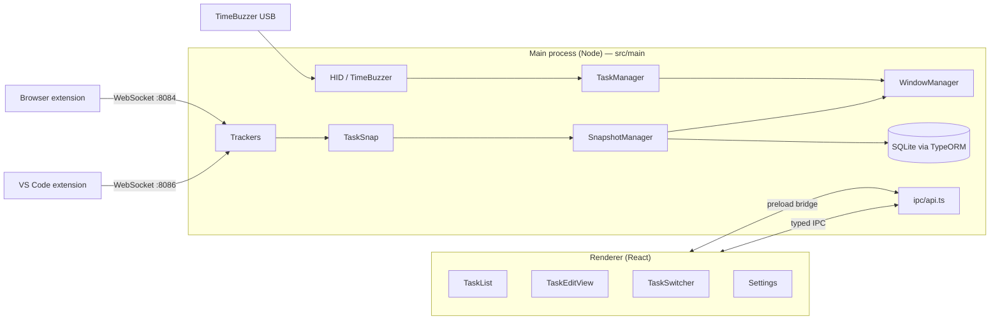

# TaskSnap — Architecture Overview

TaskSnap is an Electron desktop app (TypeScript + React) that lets users **snapshot their working context** (active windows, browser tabs, open IDE files, file-explorer paths) and group those snapshots into **tasks** and **subtasks**. A physical USB dial — the **TimeBuzzer** — drives a quick task-switcher overlay so users can rotate between tasks without leaving the keyboard.

This document is for newcomers: it lists the pieces, what each one is responsible for, and how they connect.

---

## High-level layout

```
TaskSnap/
├── src/
│   ├── main/        Electron main process (Node side) — all "business logic" lives here.
│   ├── renderer/    React UI rendered inside Electron windows.
│   └── types/       Cross-process TypeScript types shared by main + renderer.
├── release/app/PA.WindowsActivityTracker/   Native window-tracking helper (vendored).
└── assets/          Tray icons, app icons, sounds, entitlements.
```

Three sibling repos cooperate with this app:

- `TaskSnap-browser-extension-main/` — Chrome/Edge/Firefox/Safari extension that streams open tabs to the main process over a local WebSocket.
- `TaskSnap-vscode-extension-main/` — VS Code extension that streams active editor / open files over a local WebSocket.
- `TimeBuzzer/timebuzzer-buzzer-api-electron-develop/` — Node driver for the physical dial (consumed via `src/main/HID/time-buzzer.js`).

---

## Process model



- **Main process** owns all state: database, trackers, hardware, window lifecycle.
- **Renderer** is purely presentational. It calls main via the typed IPC bridge exposed in `preload.ts`.
- Cross-process types live in [src/types](src/types) so both sides stay in sync at compile time.

---

## Main-process components

### Orchestrators

| File | Role |
| --- | --- |
| [src/main/main.ts](src/main/main.ts) | Electron entry point. Initializes the DB, starts `TaskSnap`, opens the main window, registers global shortcuts, kicks off `StudyManager` and `Exporter` loops. |
| [src/main/TaskSnap.ts](src/main/TaskSnap.ts) | Top-level singleton that wires trackers together and exposes the **"create a snapshot now"** flow. Knows how to inspect the current OS state (open apps, files, browser tabs, IDE files) and persist it as a `Snapshot` row. |
| [src/main/SnapshotManager.ts](src/main/SnapshotManager.ts) | CRUD for `Snapshot` rows: read latest N, fetch by id, rename, archive, save edits, **create subtasks**, `getChildren`. The renderer reaches snapshots almost exclusively through this class. |
| [src/main/TaskManager.ts](src/main/TaskManager.ts) | Drives the **two-row task switcher overlay** (see below). Holds the in-memory carousel state — does **not** persist anything; it just selects which snapshot is the "active" task. |

#### What `TaskManager` does (in detail)

`TaskManager` is the brain of the dial-driven task switcher. It is a singleton that lives only in the main process.

- **Two cursors**: one for parent tasks (top-level snapshots), one for that parent's subtasks. A `mode: 'parent' | 'child'` flag says which cursor rotation currently moves.
- **Lifecycle**:
  - `openSwitcher()` — loads parents (most-recently-changed first, prefixed with a "None" entry) and children of the initially selected parent, opens the overlay window via `WindowManager`, and broadcasts state.
  - `cycleNext()` / `cyclePrev()` — moves the active cursor; rebuilds children when the parent changes.
  - `pressSelect()` — single dial press. In `parent` mode: drill into subtasks if any exist, otherwise commit. In `child` mode: commit.
  - `pressBack()` — double dial press. In `child` mode: pop back up to parent row. In `parent` mode: close without committing.
  - `commitSelection()` — locks the current selection in as `_activeSnapshotId` and closes the overlay. Also fires automatically after `COMMIT_DELAY_MS` (5s) of no rotation.
- **Output**: every state change broadcasts a `task-switcher-state` IPC event with `{ parents, parentIndex, children, childIndex, mode, activeTaskId }` to the overlay window. The overlay only renders what it receives — it has no logic.
- **Inputs**: rotation/press calls come from `TimeBuzzerManager`. Data comes from the `Snapshot` entity (`getLatestNSnapshots`, `getChildrenOf`).

`TaskManager` is intentionally narrow — it does not write to the DB and does not own window creation; it delegates both to its dependencies.

### Storage

| File | Role |
| --- | --- |
| [src/main/database.ts](src/main/database.ts) | TypeORM `DataSource` for a `better-sqlite3` file under the user's appData. `synchronize: true` — schema auto-syncs on entity changes (no manual migrations). |
| [src/main/entity/](src/main/entity) | All TypeORM entities. Most important ones below. |

Key entities:

- `Snapshot` — the central record. A "task" in the UI is a top-level Snapshot (`parentId IS NULL`); a "subtask" is a Snapshot whose `parentId` points at its parent. Each Snapshot links to its captured `Application`s, `Browser` + `BrowserTab`s, `IDE` + `IDEFile`s, `File`s.
- `Application` / `Browser` / `BrowserTab` / `IDE` / `IDEFile` / `File` — captured artifacts attached to a Snapshot.
- `ActiveWindow`, `ActiveBrowserTab`, `ActiveFile` — rolling timeseries of what the user actively used (independent of snapshots). Powers `FDACalculator`'s relevance scoring.
- `KnownApplication` — per-app config (icons, whether to track, etc.).
- `UsageData` — telemetry/event log (`open-snapshot-window`, `start`, …).
- `Settings`, `QuestionnaireAnswers`, `Log` — app config + study artifacts.
- `Task.ts` — registered with the data source but currently unused; "tasks" are modeled as Snapshots.

### Trackers — observe the OS and external apps

[src/main/trackers/](src/main/trackers)

| File | Role |
| --- | --- |
| `WindowTracker.ts` | Wraps the vendored `WindowsActivityTracker` (release/app/PA.WindowsActivityTracker) to receive a callback whenever the focused window changes. Forwards to `ActiveArtifact`. |
| `BrowserTracker.ts` | Runs a WebSocket server on `:8084`. The browser extension connects, streams tab/window events, and accepts commands (open/close tab). Persists tabs as `BrowserTab` rows. |
| `VSCodeTracker.ts` | WebSocket server on `:8086`. The VS Code extension reports active file / open files. Persists as `IDEFile` + `IDEFileEvent`. |
| `FileSystemWatcher.ts` | `@parcel/watcher` wrapper that records `FileSystemEvent`s. Currently dormant (no directories registered). |
| `ActiveArtifact.ts` | In-memory "what is the user looking at right now?" cache. Trackers write to it; `SummaryProvider` and `FDACalculator` read from it. |

### Hardware (USB dial)

[src/main/HID/](src/main/HID)

| File | Role |
| --- | --- |
| `time-buzzer.js` | Low-level driver for the TimeBuzzer dial (vendored). |
| `TimeBuzzerManager.ts` | Translates dial events into app intents: rotation → `TaskManager.cycleNext/Prev`, single press → `pressSelect` (or "create new snapshot" when the switcher is closed), double press → `pressBack`. Handles a 400 ms double-press window and a 5 s tap debounce. |
| `DeviceManager.ts` | Talks to a Luxafor Mute Button (a different optional device). Independent of the dial. |

### Windows and tray

| File | Role |
| --- | --- |
| [src/main/WindowManager.ts](src/main/WindowManager.ts) | Owns all `BrowserWindow`s — main app window, settings, **task-switcher overlay** (always-on-top frameless 420 × 152 popup). Single source of truth for window lifecycle so other classes never call `new BrowserWindow` directly. |
| [src/main/menu.ts](src/main/menu.ts) | Application menu bar. |
| [src/main/TrayManager.ts](src/main/TrayManager.ts) | System tray icon + menu (snapshot count, quick actions, quit). Refreshed by `SnapshotManager` after writes. |
| [src/main/preload.ts](src/main/preload.ts) | Renderer ↔ main bridge. Exposes a typed `electron` API on `window`, including `onTaskSwitcherState`. |

### Cross-cutting services

| File | Role |
| --- | --- |
| [src/main/FDACalculator.ts](src/main/FDACalculator.ts) | Implements the **Frequency–Distance–Antiquity** relevance score (Maalej et al.) used to rank a snapshot's artifacts (apps / tabs / files) by likely relevance. Reads from `ActiveWindow`/`ActiveBrowserTab`/`ActiveFile`. |
| [src/main/SummaryProvider.ts](src/main/SummaryProvider.ts) | Builds a short text summary ("most-used app + last active tab title") used to seed new snapshot names/intents. |
| [src/main/Exporter.ts](src/main/Exporter.ts) | Periodic JSON export of all snapshots into `appData/.../backup/`. |
| [src/main/StudyManager.ts](src/main/StudyManager.ts) | Drives the user-study lifecycle (phase tracking, questionnaire timing, analysis sampling). Optional — only active when a study phase is configured. |
| [src/main/AppUpdater.ts](src/main/AppUpdater.ts) | `electron-updater` wrapper. |
| [src/main/StaticSettings.ts](src/main/StaticSettings.ts) | Compile-time constants (time windows, ports, thresholds). |
| [src/main/util.ts](src/main/util.ts), [src/main/helpers/](src/main/helpers) | Path helpers, OS shell-out commands (`open`/`osascript`/PowerShell), platform detection, hashing, etc. |

### IPC layer

[src/main/ipc/](src/main/ipc)

- `api.ts` — registers all main-side handlers (`get-snapshot-by-id`, `get-snapshot-children`, `create-subtask`, `rename-snapshot`, `save-snapshot`, …). Most handlers are thin delegates to `SnapshotManager` or `TaskSnap`.
- `typedIpcMain.ts` / `typedIpcRenderer.ts` — small wrappers that turn the `Commands` and `Events` types in [src/types](src/types) into typed `invoke` / `on` calls. Adding a new IPC method = add to `Commands.ts` + register in `api.ts` + call from renderer.

---

## Renderer (React)

[src/renderer/](src/renderer) — a single React app loaded into multiple Electron windows. Routing is `HashRouter`-based so the same bundle serves every window:

| Route | Component | Window |
| --- | --- | --- |
| `/` | [TaskList.tsx](src/renderer/pages/TaskList.tsx) | Main window — list of top-level tasks. Click a row to open the edit view. |
| `/task/:id` | [TaskEditView.tsx](src/renderer/pages/TaskEditView.tsx) | Main window — per-task page: rename, list/create subtasks (one level deep), read-only artifact groups. |
| `/settings` | [Settings.tsx](src/renderer/pages/Settings.tsx) | Settings window. |
| `/taskSwitcher` | [TaskSwitcher.tsx](src/renderer/pages/TaskSwitcher.tsx) | Frameless overlay window. Renders two rows (parents top, children bottom); the active row is fully lit, the other dimmed. Pure view of the `task-switcher-state` payload. |

[src/renderer/components/](src/renderer/components) holds reusable UI: artifact cards (`Application`, `Browser`, `BrowserTab`, `IDE`, `IDEFile`, `File`), `Button`, `Input`, `Toggle`, `Toast`, `Tooltip`, `LoadingAnimation`, the `Navigation/` sidebar, `SnapshotHeader`, etc.

The renderer never touches the DB or trackers directly. Every read/write goes through `window.electron.ipcRenderer.invoke('command-name', …)`.

---

## End-to-end flows

### Creating a snapshot via the dial

1. User presses the TimeBuzzer while the switcher is closed.
2. `TimeBuzzerManager.handlePress` debounces and calls `TaskSnap.createNewSnapshot(USBDevice)`.
3. `TaskSnap` queries `WindowTracker`, `BrowserTracker`, `VSCodeTracker`, and OS helpers to collect the current artifacts.
4. `SnapshotManager` builds a `Snapshot` row + linked `Application` / `BrowserTab` / `IDEFile` / `File` rows and saves them.
5. `FDACalculator.addRelevanceToSnapshotArtifacts` scores artifacts.
6. `TrayManager.updateTray()` refreshes the tray; if the main window is open, the renderer re-fetches the list.

### Switching the active task via the dial

1. User rotates the dial → `TimeBuzzerManager` → `TaskManager.cycleNext/Prev`.
2. `TaskManager.openSwitcher` (first rotation) creates the overlay via `WindowManager.createTaskSwitcherWindow`.
3. Each cursor change broadcasts `task-switcher-state`; the overlay re-renders.
4. User single-presses → `pressSelect` either drills into subtasks (`mode → 'child'`) or commits.
5. After 5 s of inactivity, `commitSelection` fires automatically and closes the overlay.

### Editing a task

1. User clicks a row in `TaskList` → router navigates to `/task/:id`.
2. `TaskEditView` invokes `get-snapshot-by-id` and `get-snapshot-children`.
3. Title rename → `rename-snapshot`. Add subtask → `create-subtask`. Subtask click → navigates to its own `/task/:id`.
4. All writes go through `SnapshotManager`, which bumps `lastChange` so the carousel order reflects recent activity.

---

## Adding things — quick conventions

- **New IPC call**: add a typed entry to [src/types/Commands.ts](src/types/Commands.ts), register a handler in [src/main/ipc/api.ts](src/main/ipc/api.ts), call from the renderer via `window.electron.ipcRenderer.invoke('your-command', …)`.
- **New IPC event from main → renderer**: add to [src/types/Events.ts](src/types/Events.ts), expose on `preload.ts`, send via `WindowManager.<window>?.webContents.send(...)`.
- **New entity / column**: add to [src/main/entity](src/main/entity) and register in [src/main/database.ts](src/main/database.ts) `entities: [...]`. `synchronize: true` will create the schema on next launch.
- **New tracker / data source**: drop into [src/main/trackers](src/main/trackers) and have `TaskSnap.start()` instantiate it. Update `ActiveArtifact` if the data should feed into FDA scoring.
- **New renderer page**: add to [src/renderer/pages](src/renderer/pages) and register a route in [App.tsx](src/renderer/App.tsx).

---

## What lives where — single-glance map

```
main.ts                 boot sequence
  └─ TaskSnap           top-level orchestrator (snapshot creation)
       ├─ trackers/     observe OS + external apps -> ActiveArtifact + DB
       ├─ SnapshotManager  CRUD for Snapshot (incl. subtasks)
       ├─ FDACalculator   artifact relevance scoring
       ├─ SummaryProvider auto-name/intent for new snapshots
       └─ Exporter        periodic JSON backups

TaskManager             dial carousel state (parent/child cursors)
  └─ WindowManager      owns the overlay window
TimeBuzzerManager       USB dial -> TaskManager / TaskSnap

ipc/api.ts              typed IPC handlers (renderer -> main)
preload.ts              typed bridge exposed on window.electron

renderer/
  App.tsx               HashRouter
  pages/TaskList        / (main)
  pages/TaskEditView    /task/:id
  pages/TaskSwitcher    /taskSwitcher (overlay)
  pages/Settings        /settings
  components/           reusable UI primitives + artifact cards

types/                  shared TS types (Commands, Events, entity DTOs)
```
